# Deploy containerized application to EC2 VM using Github Actions.  

## A step-by-step guide to automating container builds, security scans, and deployments with AWS ECR, OIDC, and SonarQube

## Overview
This step-by-step guide walks through building a fully automated CI/CD pipeline that deploys a containerized web application to an AWS EC2 instance whenever code is pushed to the main branch. The pipeline includes static code analysis with SonarQube, container vulnerability scanning with Trivy, image storage in Amazon ECR, and deployment over SSH — all without storing AWS credentials in GitHub.  

The 6 steps covered in this guide are:  
•	Step 1: Provision an EC2 Instance with Docker and AWS cli installed   
•	Step 2: Prepare the GitHub Repository & Workflow  
•	Step 3: Configure AWS IAM for Secure OIDC Authentication (GitHub → ECR)  
•	Step 4: Create an EC2 IAM Role to Pull Images from ECR  
•	Step 5: Set Up SonarQube & Configure GitHub Secrets/Variables  
•	Step 6: Trigger the Pipeline and Verify Deployment  

Here is the git repository - **https://github.com/ucheor/GithubActions_EC2_ECR_OIDC_Docker_QR.git**

 
## Step 1: Provision an EC2 Instance with Docker  
Before any deployment pipeline can run, we need a target server. In this step we launch an Ubuntu EC2 instance on AWS, configure its network security settings to allow web traffic, and use EC2 User Data to automatically install Docker when the instance first starts up. This means the server will be ready to run containers immediately, without any manual SSH installation steps.

**1.1 — Launch the EC2 Instance**  
From the EC2 Dashboard, click Launch instance to begin creating a new virtual server.  
 
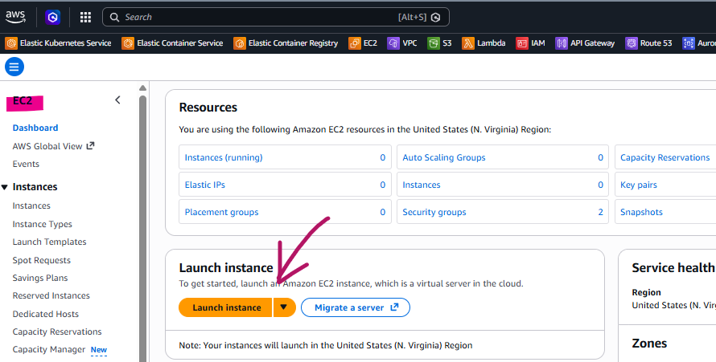 

---

Configure the instance with the following settings:   
•	Name: clock-app-ucheor   
•	AMI: Ubuntu Server 24.04 LTS (free tier eligible)    
•	Instance type: t3.medium (2 vCPU, 4 GB RAM — provides enough headroom to run Docker and the SonarQube container)  


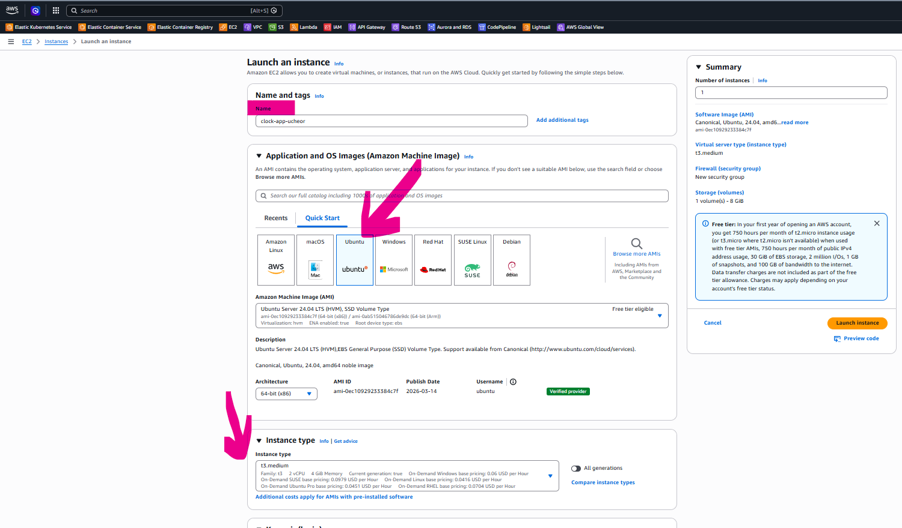

---

**1.2 — Key Pair & Security Group**  
Create or select an existing key pair — this .pem file is required to SSH into the instance for verification steps. Then click Edit in the Network settings section to configure firewall rules.  
 
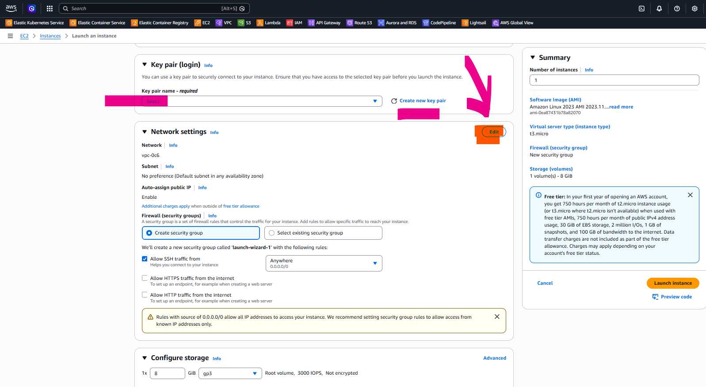

---

Add a custom inbound security group rule to open port 8085. This is the port our application will be accessible on. The workflow YAML sets ACCESS_PORT: 8085 and Docker maps this host port to the container's port 80. Port 22 (SSH) should also be open to allow the GitHub Actions runner to deploy via SSH.  
 
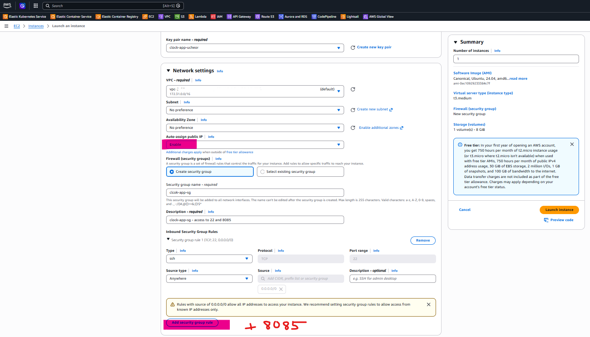

---

**Note:** In a for more security, consider restricting the source IP ranges for both SSH (port 22) and the app port to known CIDR blocks rather than 0.0.0.0/0.

**1.3 — Add User Data to Auto-Install Docker and AWS CLI**  
Scroll down to Advanced details to find the User data field. This bash script runs automatically when the instance launches for the first time. It installs Docker, starts and enables the Docker service, adds the ubuntu user to the docker group (so Docker can run without sudo), and installs the AWS CLI (required so the EC2 instance can authenticate with ECR to pull images).  
 
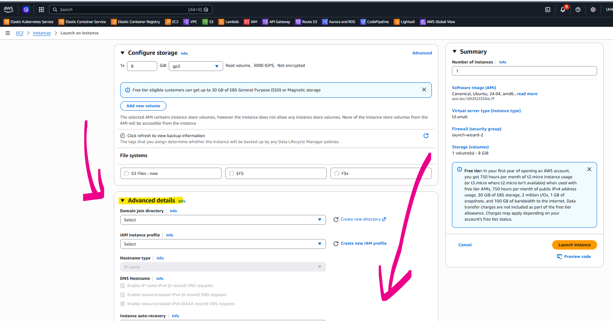

---

Paste the following User Data script:

```
#!/bin/bash 

apt update -y 

apt install docker.io -y 
systemctl start docker 
systemctl enable docker 

usermod -aG docker ubuntu 
newgrp docker 

curl "https://awscli.amazonaws.com/awscli-exe-linux-x86_64.zip" -o "awscliv2.zip" 
apt install -y unzip 
unzip awscliv2.zip 
./aws/install
```
---
 
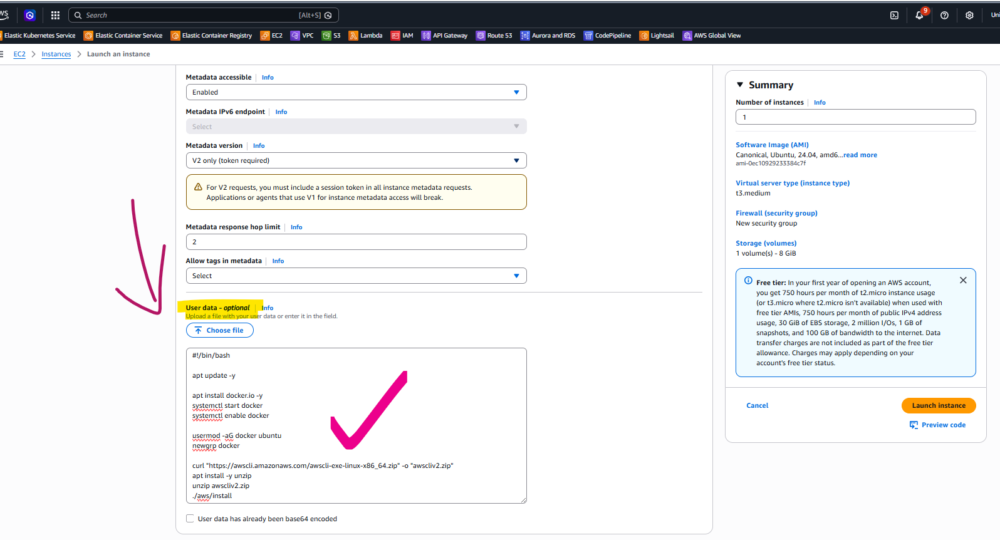  

--- 

Click Launch instance. AWS will show a success confirmation screen.
 
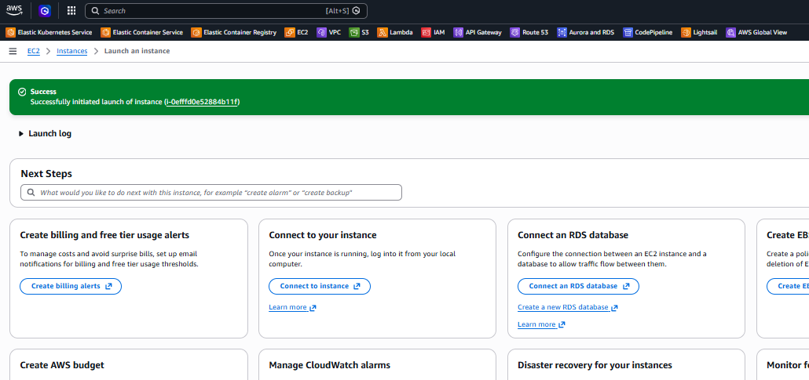

---

**1.4 — Verify Docker is Running and AWS CLI is installed**  
Once the instance state shows Running and status checks pass, connect via EC2 Instance Connect (or SSH with your .pem key). Run the following commands to verify that Docker installed correctly and the daemon is active:  

```
docker --version 
docker ps
aws --version
```
 
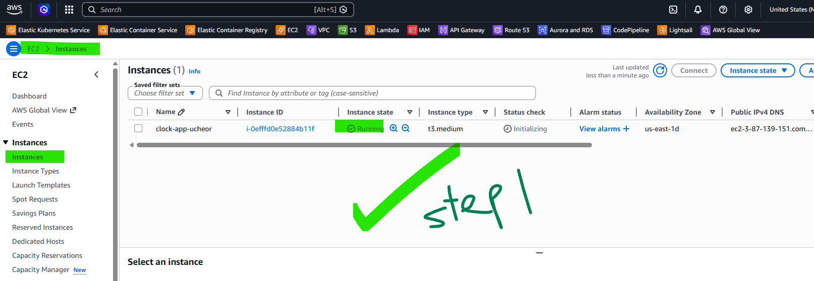

---
 
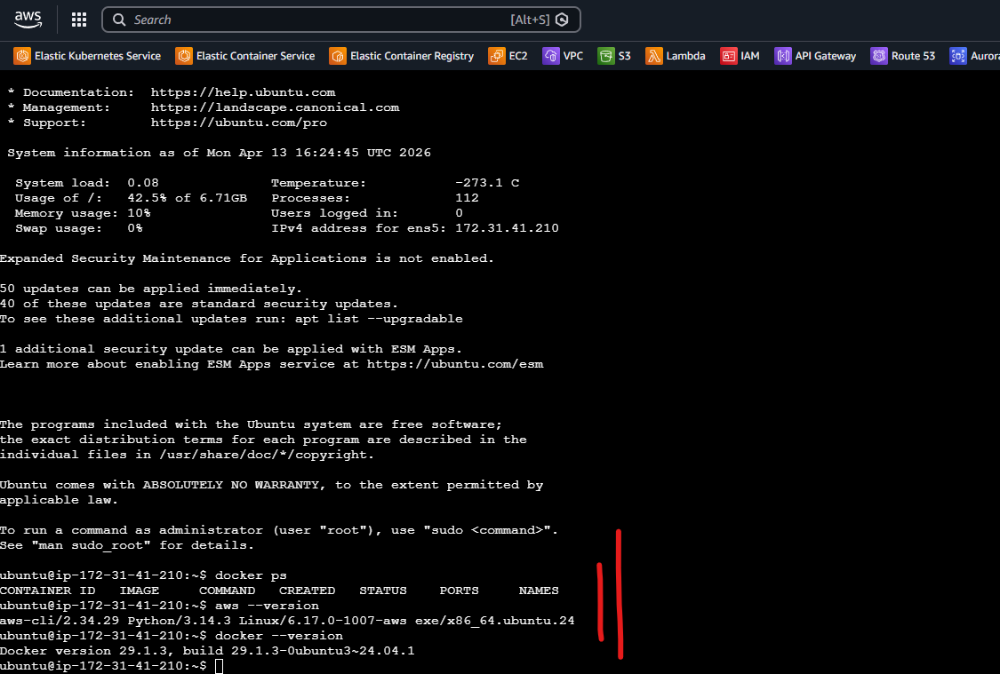

---

A successful docker ps output (with no containers yet) confirms the instance is ready for deployments. “aws –version” should also confirm aws is installed.  


## Step 2: Prepare the GitHub Repository & Workflow  
With the server ready, the next step is to ensure the application code is in GitHub and that the GitHub Actions workflow file is correctly structured. The workflow YAML is the heart of the CI/CD pipeline — it defines every automated step from code checkout to deployment.  

**2.1 — Confirm Application Code is in the Repository**  
Push your application files to the main branch of your GitHub repository. After full set up, the repository should contain: clock.html (the web application), a Dockerfile to containerize it, and the workflow YAML placed at .github/workflows/. 

The Dockerfile used in this project is:  

```
FROM nginx:alpine 
ARG OWNER="YourName" 
COPY clock.html /usr/share/nginx/html/index.html 
RUN sed -i "s/__NAME__/${OWNER}/g" /usr/share/nginx/html/index.html 
EXPOSE 80 
CMD ["nginx", "-g", "daemon off;"]
```

This uses nginx:alpine as a lightweight base, copies the HTML app into nginx's web root, and personalizes it by replacing the __NAME__ placeholder with the OWNER build argument.   

 
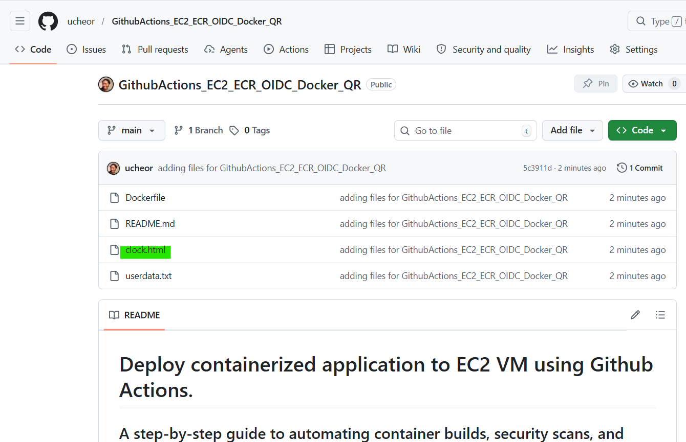

---

**2.2 — Review the GitHub Actions Workflow**  
The workflow file (clock-app-workflow.yaml) must be placed in .github/workflows/. It triggers on every push to main. Key sections include:  
•	permissions block: Sets id-token: write, which is REQUIRED to use OIDC authentication with AWS — without this, the workflow cannot assume the IAM role.  
•	env block: Pulls all sensitive values from GitHub Secrets and Variables (no hardcoded credentials).  
•	Jobs: A single job that runs checkout → AWS auth → ECR login → SonarQube scan → Docker build → Trivy scan → push to ECR → SSH deploy → health check.  
 
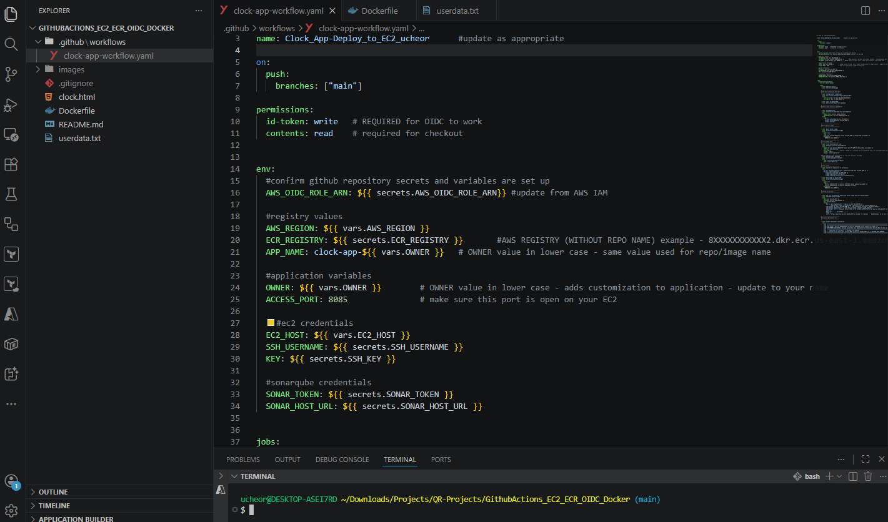

---

**Note:** The workflow uses OIDC (OpenID Connect) to authenticate with AWS, which means no AWS_ACCESS_KEY_ID or AWS_SECRET_ACCESS_KEY secrets are needed. The role-to-assume approach is significantly more secure.  

 
## Step 3: Configure AWS IAM for Secure OIDC Authentication  
This step sets up the trust relationship that allows GitHub Actions to authenticate with AWS without storing long-lived credentials. AWS OIDC (OpenID Connect) lets GitHub Actions exchange a short-lived JWT token for temporary AWS credentials by assuming an IAM role. We need to: (1) register GitHub as a trusted Identity Provider in AWS IAM, and (2) create an IAM role that GitHub Actions can assume to push images to ECR.

**3.1 — Add GitHub as an OIDC Identity Provider**  
Navigate to IAM → Identity providers and click Add provider.  

**Note:** If you already have GitHub set up as an identity provider. Continue with next step: Create the OIDC IAM Role for GitHub Actions  

 
  

---

Select OpenID Connect as the provider type, then enter:  
•	Provider URL: https://token.actions.githubusercontent.com  
•	Audience: sts.amazonaws.com  
 
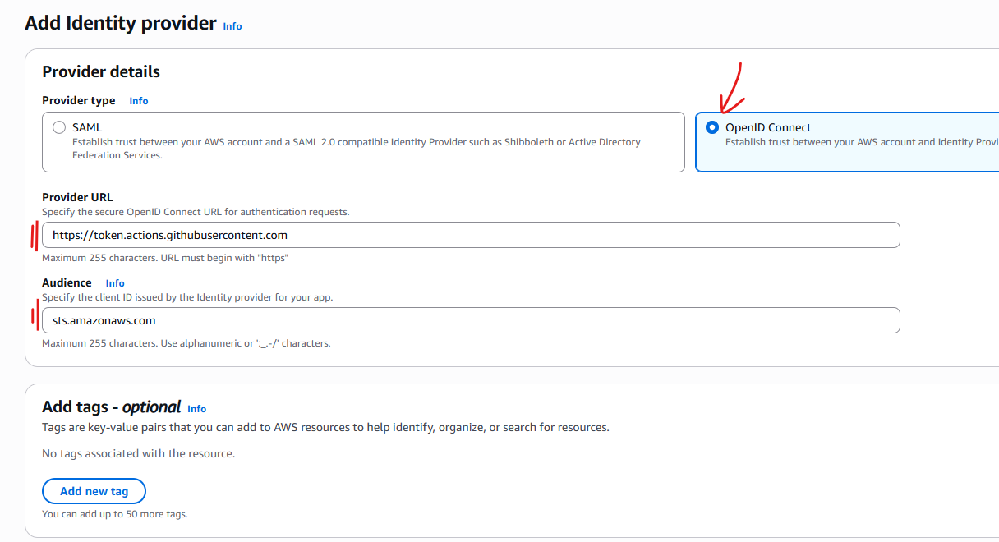  

---

After saving, you will see the GitHub Actions provider listed with type OpenID Connect.
 


---

**3.2 — Create the OIDC IAM Role for GitHub Actions**  
Go to IAM → Roles → Create role. This role will be assumed by GitHub Actions to push Docker images to ECR.  
 
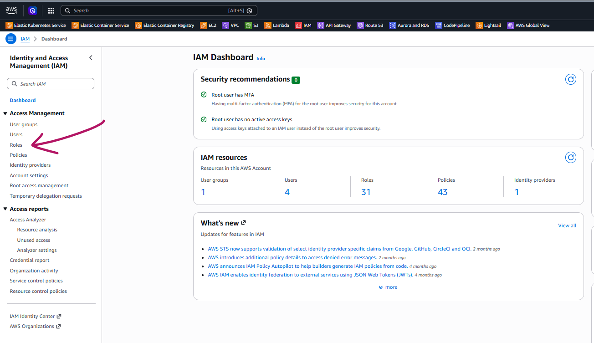 

---

Select Web identity as the trusted entity type, choose token.actions.githubusercontent.com as the Identity Provider, set Audience to sts.amazonaws.com, and enter your GitHub organization name (e.g., ucheor)

**Note:** You can use a wildcard * for repository to allow all repos, or specify a particular one for tighter security.
 
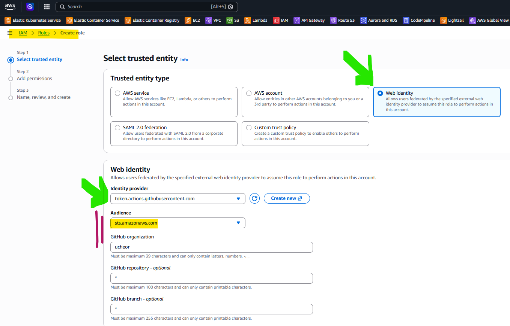 

---

On the permissions page, search for and select **AmazonEC2ContainerRegistryFullAccess**. This policy allows GitHub Actions to create ECR repositories and push Docker images.  
 
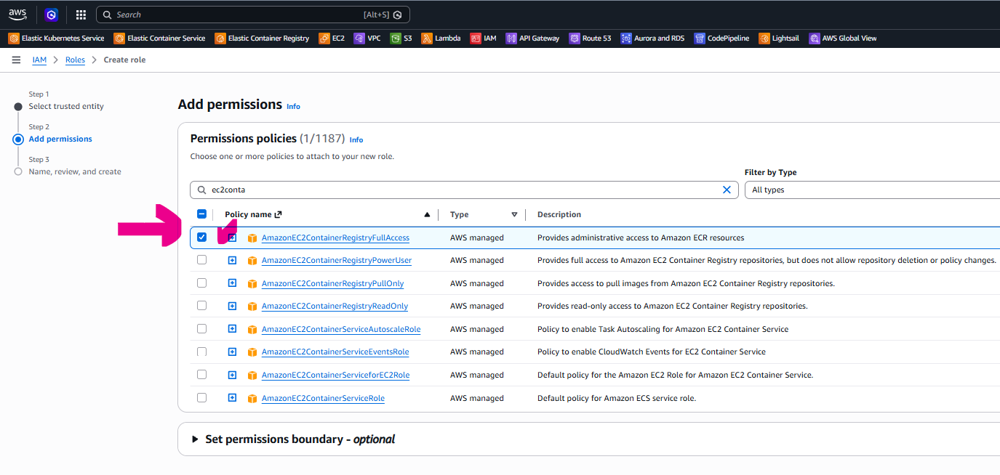  

---

The policy is now attached to the role before creation. We can also consider a role with lower privileges as best practice.
 
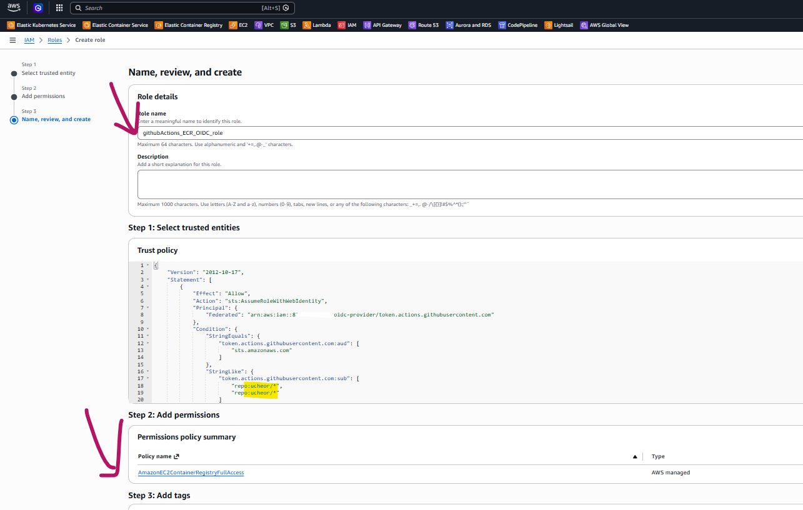 

---

Name the role githubActions_ECR_OIDC_role and review the trust policy JSON. It should show StringLike conditions restricting the role to your GitHub organization. Confirm the AmazonEC2ContainerRegistryFullAccess policy is in the permissions summary, then create the role.   
 
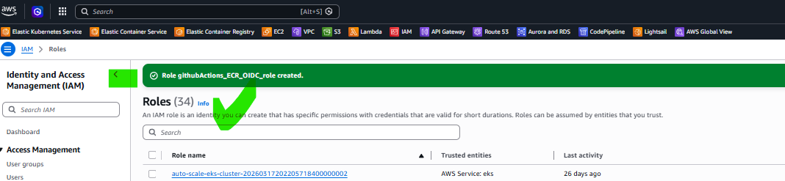

---
 
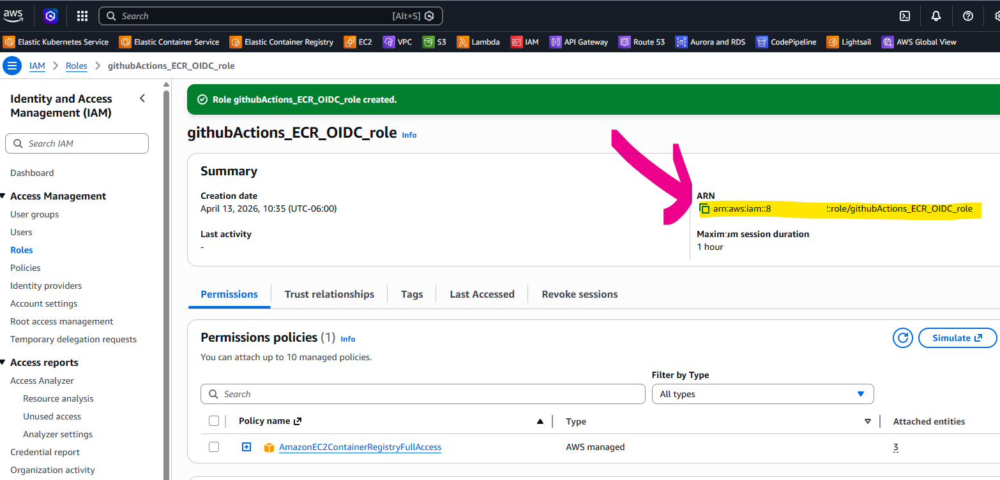

---

Copy the Role ARN (highlighted in the image above). This value goes into the GitHub repository secret named AWS_OIDC_ROLE_ARN.

 
## Step 4: Create an EC2 IAM Role to Pull Images from ECR  
The OIDC role from Step 3 allows GitHub Actions to push images to ECR. But the EC2 instance itself also needs permission to pull those images during deployment. The SSH deploy step in the workflow runs aws ecr get-login-password on the EC2 instance, which requires the instance to have an IAM role attached with ECR pull permissions. This is a separate role scoped specifically for the EC2 service.  

**4.1 — Create the EC2 Service Role**  
Go to IAM → Roles → Create role. This time, select AWS service as the trusted entity type and choose EC2 as the use case. This creates a role that EC2 instances can assume — not GitHub Actions.  
 
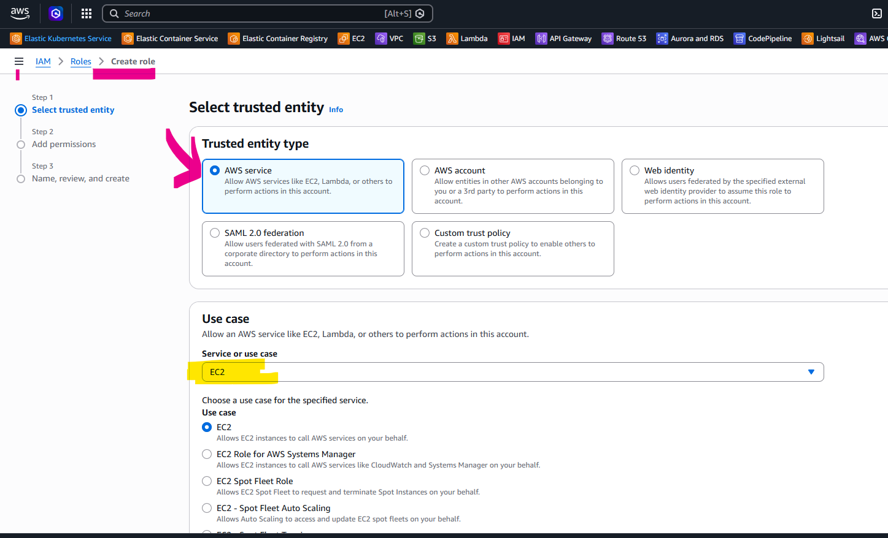 

---

On the permissions page, search for select AmazonEC2ContainerRegistryPullOnly. This policy gives the instance permission to pull images from ECR, but not push or delete — following the principle of least privilege.  
 
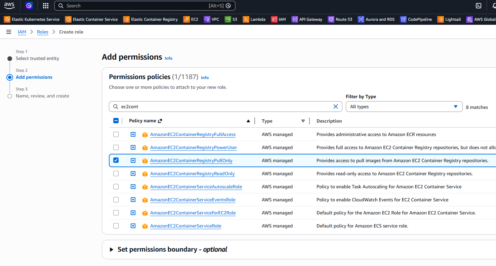

---

Name the role ECRPullOnly_for_EC2_Service. Review the trust policy (principal is ec2.amazonaws.com) and confirm the PullOnly policy is attached, then create.  
 
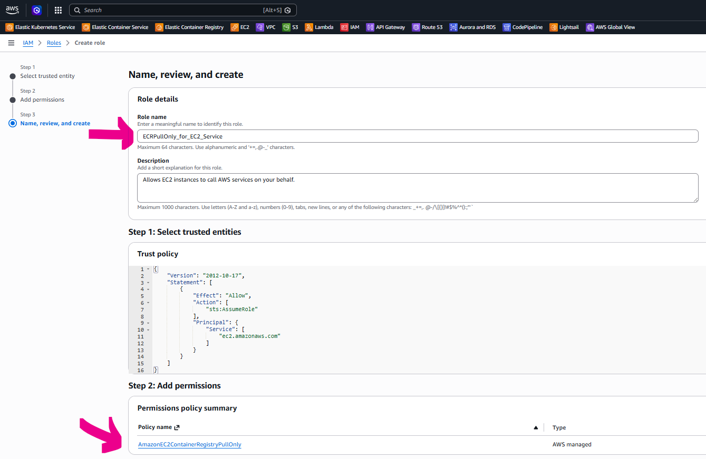 

---

**4.2 — Attach the Role to the EC2 Instance**  
Return to EC2 → Instances. Select the clock-app-ucheor instance, then go to Actions → Security → Modify IAM role.  
 
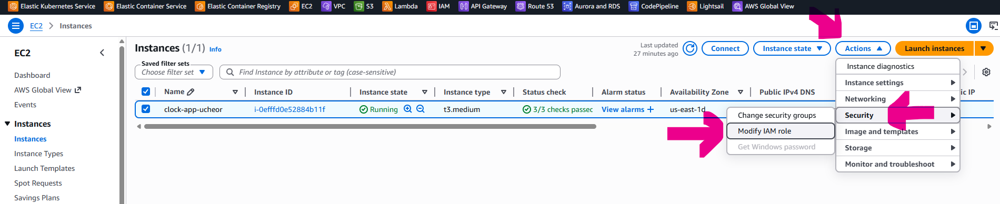

---

Select your newly created role - ECRPullOnly_for_EC2_Service from the dropdown and click Update IAM role. The instance now has permission to authenticate with ECR and pull Docker images without any credentials stored on the server.  
 
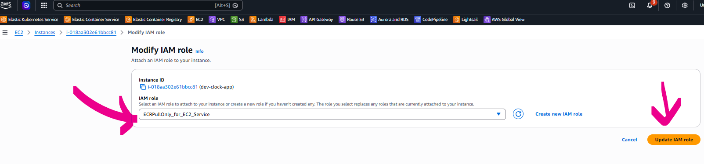 

---

**Note:** Without this role, the deploy step in the workflow (aws ecr get-login-password) will fail with an authorization error because the instance has no identity to present to ECR.  

 
## Step 5: Set Up SonarQube & Configure GitHub Secrets/Variables  
The workflow includes a SonarQube static code analysis step that scans the codebase for bugs, vulnerabilities, and code quality issues before building the Docker image. SonarQube Community Edition can be run as a container on the same EC2 instance. After it is running, we configure all required GitHub Secrets and Variables so the workflow can reference them securely.  

**5.1 — Run SonarQube on the EC2 Instance**  
SSH into the EC2 instance and start SonarQube as a Docker container on port 9000:  
```
docker run -d -p 9000:9000 sonarqube:community
```

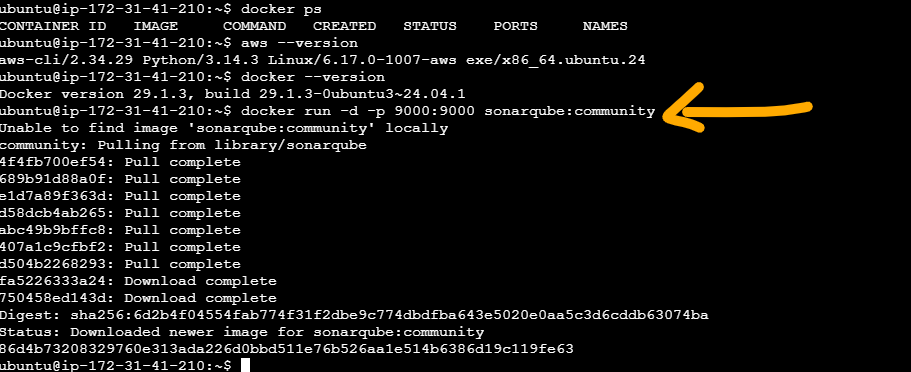 

---

Open port 9000 in the EC2 security group so the SonarQube web UI is accessible. This is added as a new inbound rule alongside the existing port 8085 and SSH rules.  
 
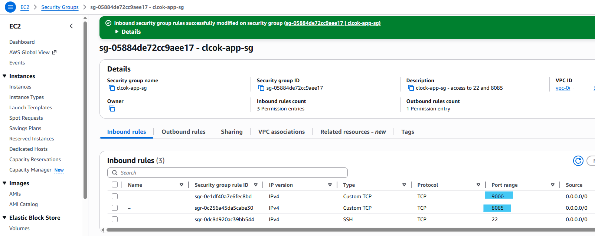 

---

Open a browser and navigate to http://<your-EC2-public-IP>:9000. Log in with the default credentials (admin / admin) and set a new password when prompted.   
 
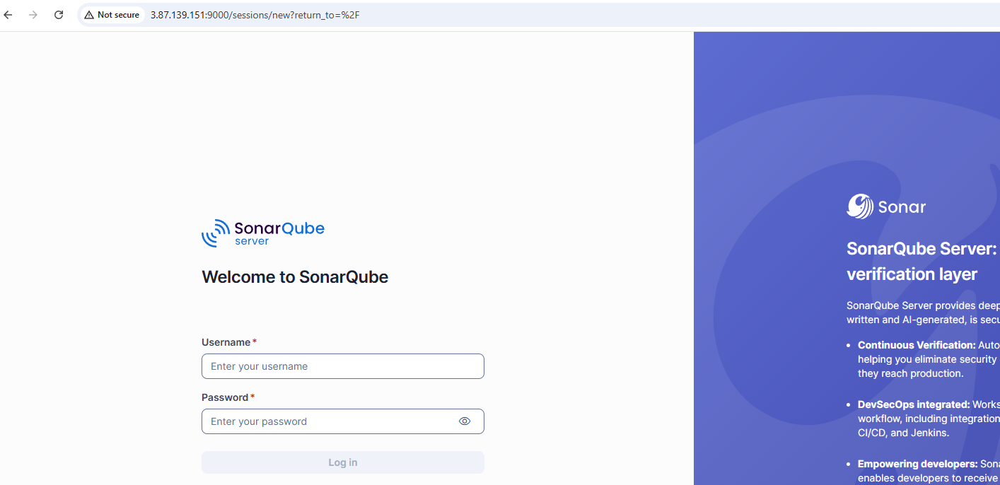 

---

**5.2 — Generate a SonarQube Token**  
In SonarQube, go to the user menu (top right) → My Account → Security. Enter a token name (e.g., clock-app), select User Token type, set an expiry, and click Generate. Copy the token immediately — it will not be shown again. This token is added to GitHub Secrets as SONAR_TOKEN.  
 
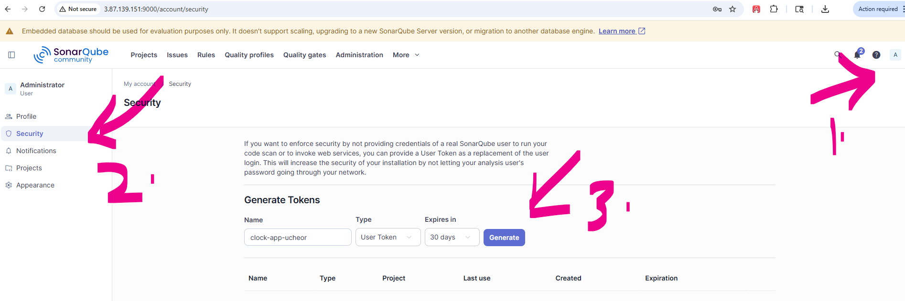

---

**5.3 — Configure GitHub Repository Secrets**  
In your GitHub repository, go to Settings → Security → Secrets and variables → Actions → Secrets tab.   

Add the following repository secrets:  
•	AWS_OIDC_ROLE_ARN — the ARN of the githubActions_ECR_OIDC_role from Step 3  
•	ECR_REGISTRY — your ECR registry URL (without repo name), e.g. 123456789012.dkr.ecr.us-east-1.amazonaws.com  
•	SSH_KEY — the private key (.pem file contents) for SSH access to the EC2 instance  
•	SSH_USERNAME — ubuntu (the default username for Ubuntu AMIs)  
•	SONAR_TOKEN — the token generated in step 5.2  
•	SONAR_HOST_URL — http://your-EC2-public-IP:9000         #update with your EC2 public IP address
 
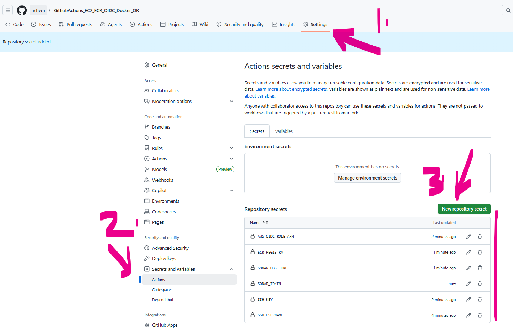

---

**5.4 — Configure GitHub Repository Variables**  
Switch to the Variables tab and add the following (variables are not encrypted, suitable for non-sensitive config):  
•	AWS_REGION — e.g. us-east-1  
•	EC2_HOST — the public IPv4 address of the EC2 instance  
•	OWNER — your name in lowercase (used to personalize the app and name the ECR repo/image)  
 
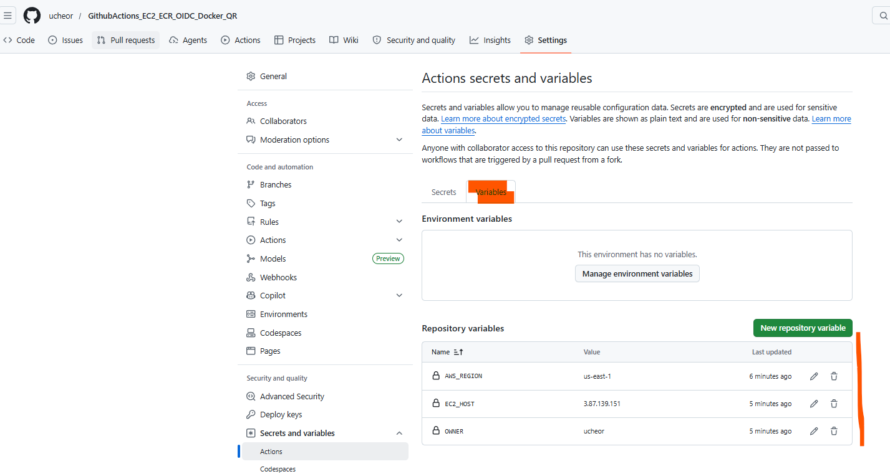  

---

**Note:** EC2_HOST must be updated whenever the instance is stopped and restarted, as the public IP changes for non-Elastic IPs. Consider assigning an Elastic IP to avoid this.  

 
## Step 6: Trigger the Pipeline and Verify Deployment  
With all infrastructure, IAM permissions, and GitHub configuration in place, it is time to trigger the pipeline. The workflow runs automatically on every push to the main branch. The pipeline will: authenticate with AWS via OIDC → log in to ECR → scan code with SonarQube → build the Docker image → scan for vulnerabilities with Trivy → push the image to ECR → SSH into EC2, pull and run the new container → perform a health check → print the deployment URL.  

**6.1 — Push to the main Branch**  
Commit and push the workflow YAML and any application changes to the main branch:  

```
git add -A   
git commit -m "your commit message"   
git push  
```

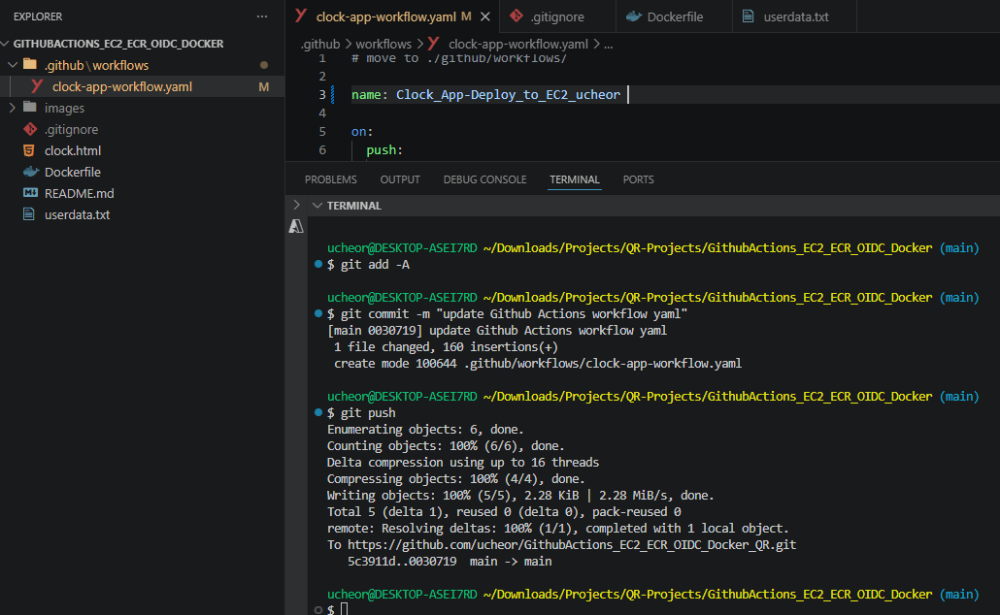

---

As soon as the push is received by GitHub, the Actions workflow is triggered automatically.  

**6.2 — Monitor and Confirm the Workflow**  
Navigate to the Actions tab in your GitHub repository. You will see the workflow run listed. A green checkmark indicates all steps passed. The workflow name is Clock_App-Deploy_to_EC2_ucheor and you can click into any run to see the full logs for each step.  
 
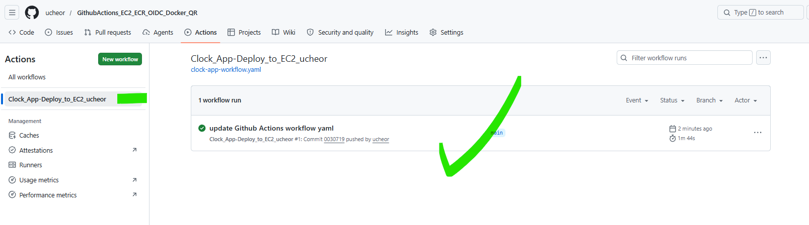  

---

The final step in the workflow outputs the deployment URL:  

DEPLOYMENT SUCCESSFUL! You can now access your application at http://<EC2_HOST_IP_ADDRESS>:8085  

Open http://<EC2_HOST_IP_ADDRESS>:8085 in a browser to confirm the application is live. The clock application should display, personalized with the OWNER name set in the repository variables.   

**Note:** The workflow includes a built-in health check (curl -f http://localhost:8085) that runs inside the EC2 SSH step. If the application fails to start, the pipeline will fail and the deployment will be rolled back.  

---

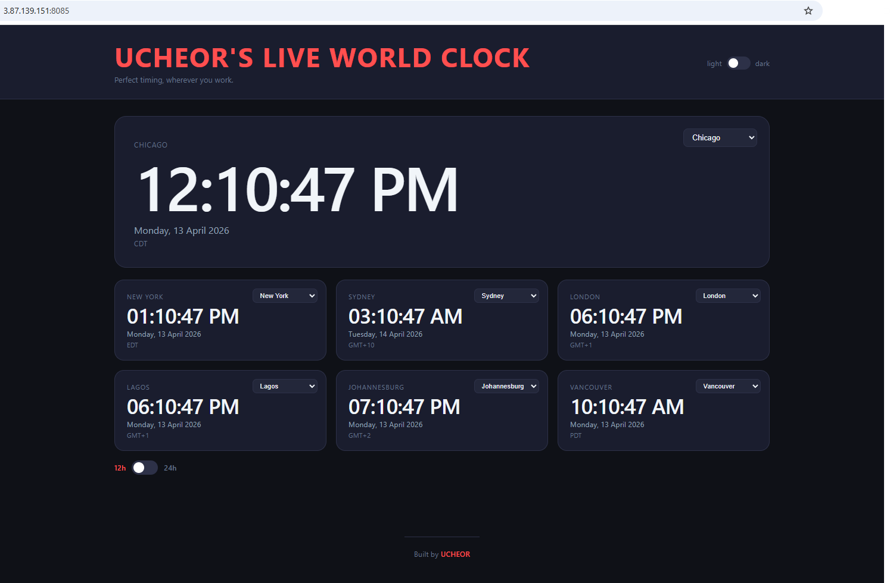

---

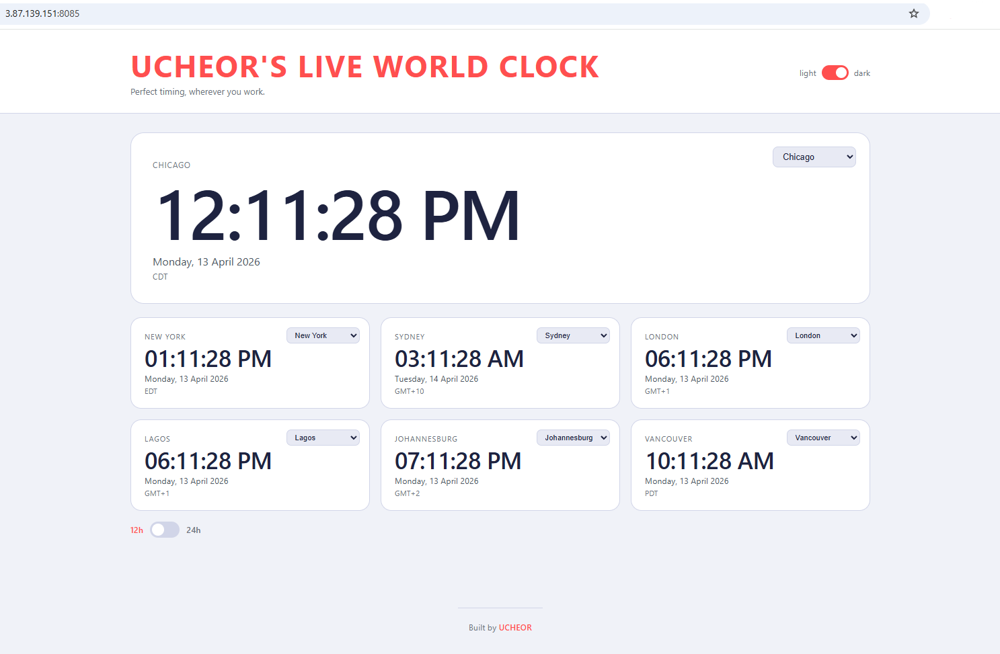

---

**6.3 — View your SonarQube and Trivy reports**  
Head over to your SonarQube application and click on Projects to view your project and the results from the scan. You can extend the functionality of SonarQube by collaborating with the App Owner to set up Quality Gates. This sets the threshold for the amount issues you can allow in your applications. In situations where the Quality Gate is exxeeded, the pipeline should fail and a report sent to the appropriate dev team.

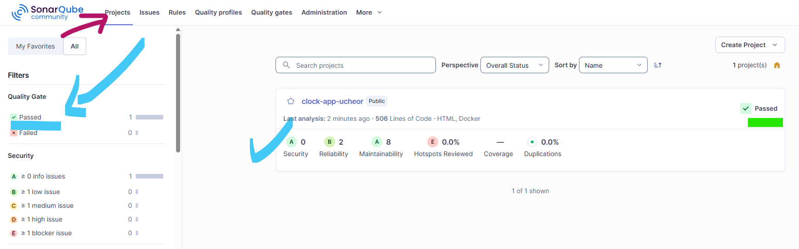

---

For the Trivy image scan, we downloaded a document that has been saved as an artifact on GitHub. You can access it, send it to a team member or store it in a different location based on your work requirements.

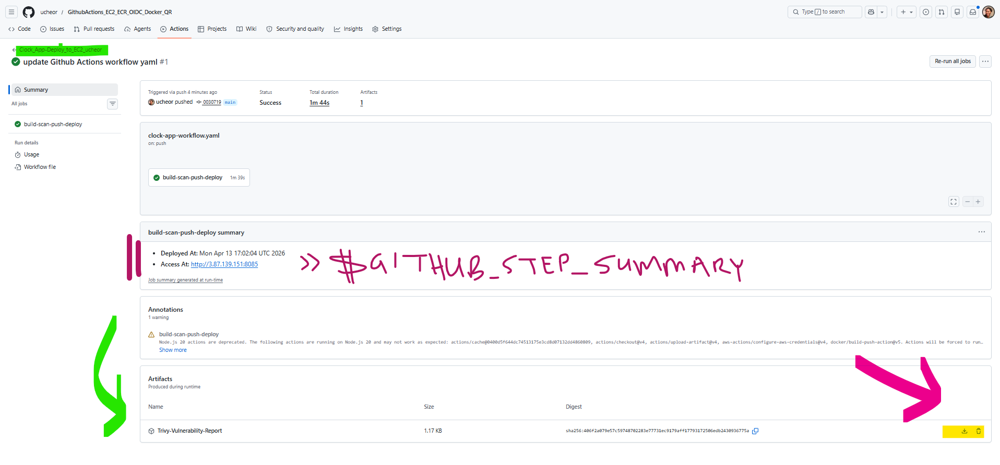

---

Head over to your Elastic Container Registry (ECR) on AWS. Your new image should be visible with all associated versions.

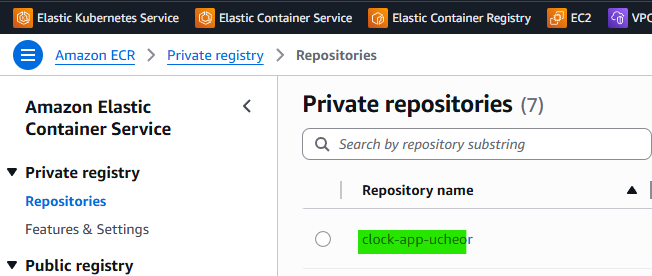

---


## Clean Up

Once you are done with your AWS resources, remember to delete. This includes both roles, security group, and the EC2 instance we created (most important to avoid charges).


## Summary

You have successfully built a complete CI/CD pipeline that deploys a containerized application to AWS EC2 using GitHub Actions. The pipeline is secure (OIDC — no stored AWS credentials), automated (triggers on every push to main), and observable (SonarQube code quality + Trivy vulnerability reports available as workflow artifacts).

**Key concepts covered:**  
•	EC2 User Data to provision servers automatically on launch  
•	OIDC federation between GitHub Actions and AWS IAM (no long-lived credentials)  
•	Separate IAM roles for push (GitHub → ECR) and pull (EC2 → ECR) with least privilege  
•	SonarQube for static code analysis as part of the CI gate  
•	Trivy for container image vulnerability scanning  
•	Automated health checks to verify deployments before the pipeline succeeds  

---

Made it to the end of this quick refresher? Congratulations!! Feel free to connect.